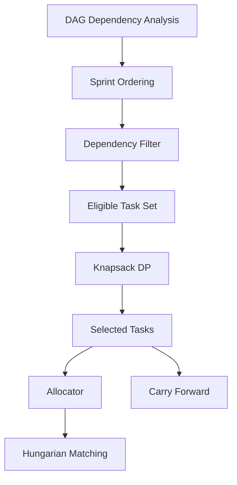

# 스프린트 플래너 (Module 3) 구현 및 유기적 연동 설계서

## 프로젝트 개요

본 설계서는 README.md에 제시된 과제 요구사항을 충족하기 위해 **스프린트 용량(Sprint Capacity) 제한 내에서 비즈니스 가치를 최대화하는 Sprint Planner(Module 3)** 를 설계하고, 기존의 **프로젝트 스케줄러(Module 1)** 및 **개발자 배정기(Module 2)** 와 유기적으로 연동하는 방안을 정의한다.

본 모듈은 단순히 작업을 스프린트에 배치하는 것이 아니라, 프로젝트의 의존성 구조와 스프린트 용량을 고려하여 가장 높은 가치를 제공하는 태스크 조합을 선택하는 것을 목표로 한다.

---

# 1. 과목 요구사항 반영 계획

| 요구사항 | 적용 내용 |
|----------|----------|
| 자료구조 2개 이상 | Dict, Set, 2D DP Table |
| 알고리즘 2개 이상 (서로 다른 계열) | Dynamic Programming, Backtracking, Greedy |
| 한글 주석 | 주요 함수 및 알고리즘 설명 작성 |
| Python 표준 라이브러리 사용 | planner.py는 stdlib만 사용 |
| 시각화 | Streamlit 기반 결과 시각화 |
| 성능 비교 | Greedy vs DP vs Backtracking |

---

# 2. 문제 정의

## 입력

각 태스크는 다음 정보를 가진다.

```python
Task
(
    id,
    project_id,
    estimate,
    value,
    depends_on
)
```

- estimate : 스토리 포인트
- value : 비즈니스 가치
- depends_on : 선행 태스크 목록

스프린트는 다음 정보를 가진다.

```python
Sprint
(
    sprint_id,
    capacity
)
```

---

## 목표

스프린트 용량을 초과하지 않는 범위에서

```text
총 비즈니스 가치(Total Value)
```

를 최대화하는 태스크 집합을 선택한다.

---

# 3. 대표 알고리즘 설계

## 3.1 0/1 Knapsack DP

### 적용 이유

본 문제는

- 제한된 용량
- 각 태스크의 가치
- 태스크 선택 여부

를 고려해야 하므로 전형적인 0/1 Knapsack Problem으로 모델링 가능하다.

---

### 모델링

| Knapsack | Sprint Planning |
|----------|----------------|
| Weight | Estimate |
| Value | Business Value |
| Capacity | Sprint Capacity |
| Item | Task |

---

### 점화식

dp[i][w]

=

i번째 태스크까지 고려했을 때

용량 w에서 얻을 수 있는 최대 가치

```text
dp[i][w] =
max(
    dp[i-1][w],
    dp[i-1][w-estimate_i] + value_i
)
```

---

### 역추적

DP 테이블 생성 후

```python
dp[N][W]
```

부터 역방향으로 탐색하여 실제 선택된 태스크를 복원한다.

---

### 시간복잡도

```text
O(NW)
```

### 공간복잡도

```text
O(NW)
```

---

## 3.2 Backtracking

### 목적

모든 가능한 조합을 탐색하여 최적해를 찾는다.

---

### 탐색 구조

```text
선택
 ├── 선택
 │     ├── 선택
 │     └── 미선택
 └── 미선택
       ├── 선택
       └── 미선택
```

---

### 가지치기 조건

#### 1. 용량 초과

```python
current_estimate > capacity
```

즉시 종료

---

#### 2. 가치 상한

```python
current_value + remaining_value
<= best_value
```

이면 종료

---

#### 3. Fractional Knapsack Bound

남은 용량을 가치 밀도 기준으로 채운다고 가정하여

Upper Bound를 계산한다.

이를 통해 탐색 공간을 크게 줄일 수 있다.

---

### 시간복잡도

최악

```text
O(2^N)
```

---

## 3.3 Greedy

### 목적

비교용 Baseline 알고리즘

---

### 기준

```python
value / estimate
```

가 높은 순으로 정렬

---

### 시간복잡도

```text
O(N log N)
```

---

# 4. 자료구조 활용

## 4.1 Dict

태스크 ID 기반 조회

```python
tasks_by_id[task_id]
```

평균 조회

```text
O(1)
```

---

## 4.2 Set

완료 태스크 저장

```python
completed_tasks = set()
```

의존성 검사

```python
if dependency in completed_tasks:
```

평균 조회

```text
O(1)
```

---

## 4.3 2D DP Table

```python
dp[i][w]
```

동적계획법 상태 저장

---

# 5. Module 1 ↔ Module 3 ↔ Module 2 연동

## 전체 구조



---

# 6. Dependency-Aware Planning

중요한 점은

**배낭 DP는 의존성을 직접 처리하지 않는다.**

---

## Eligible Candidate 생성

어떤 태스크가 후보군이 되기 위해서는

```python
all(
 dep in completed_tasks
 for dep in task.depends_on
)
```

을 만족해야 한다.

---

즉

```text
선행 작업 완료
↓
Eligible Set 포함
↓
DP 수행
```

과정을 거친다.

---

# 7. Carry Forward 전략

용량 부족으로 선택되지 못한 태스크는 삭제하지 않는다.

---

```text
Current Sprint
↓
Unselected Tasks
↓
Carry Forward
↓
Next Sprint
```

---

장점

- 작업 손실 없음
- 가치 최대화 유지
- 실제 Agile 방식 반영

---

# 8. 데이터 모델 설계

## SprintResult

```python
class SprintResult:

    sprint_id: str

    selected_tasks: list

    carried_tasks: list

    total_value: int

    used_capacity: int
```

---

## SprintPlanner

```python
class SprintPlanner:

    def greedy_plan(self):
        pass

    def dp_plan(self):
        pass

    def backtracking_plan(self):
        pass

    def global_plan(self):
        pass
```

---

# 9. 실험 계획

## 비교 알고리즘

1. Greedy
2. DP
3. Backtracking

---

## 데이터셋

| 규모 | 태스크 수 |
|--------|--------|
| Small | 20 |
| Medium | 50 |
| Large | 100 |
| Real Dataset | 153 |

---

## 측정 항목

### 실행 시간

```text
Execution Time (ms)
```

### 총 가치

```text
Total Business Value
```

### 활용률

```text
Capacity Utilization (%)
```

### 완료 태스크 수

```text
Completed Task Count
```

---

# 10. README 반례 검증

문제

| Task | Estimate | Value |
|--------|--------|--------|
| A | 6 | 60 |
| B | 5 | 40 |
| C | 5 | 40 |

Capacity = 10

---

## Greedy

선택

```text
A
```

결과

```text
60
```

---

## DP

선택

```text
B + C
```

결과

```text
80
```

---

결론

```text
Greedy ≠ Optimal
DP = Optimal
```

---

# 11. 시각화 설계

## 단일 스프린트 시각화

- Greedy 결과
- DP 결과
- Backtracking 결과

---

## 글로벌 플래닝 시각화

각 Sprint별

- 선택 태스크
- 이월 태스크
- 사용 용량
- 가치

표시

---

## Dashboard

### Planner 적용 전

- Total Value
- Capacity Utilization

---

### Planner 적용 후

- Total Value
- Capacity Utilization

---

향상률 계산

```text
Improvement(%)
```

---

# 12. 평가 지표

| 지표 | 의미 |
|--------|--------|
| Total Business Value | 총 가치 |
| Capacity Utilization | 활용률 |
| Completed Task Count | 완료 수 |
| Carry Forward Count | 이월 수 |
| Dependency Violation Count | 의존성 위반 수 |

---

목표

```text
Dependency Violation Count = 0
```

---

# 13. Verification Plan

## Automated Verification

### Demo

```bash
python planner.py --demo-only
```

검증

```text
Greedy = 60
DP = 80
Backtracking = 80
```

---

### Full Planning

```bash
python planner.py
```

검증

- 전체 태스크 처리
- 의존성 위반 없음
- 스프린트 생성 성공

---

## Manual Verification

```bash
streamlit run app.py
```

확인 항목

- Module 3 탭 생성
- 차트 렌더링
- 가치 비교
- Carry Forward
- Sprint 결과

---

# 14. 기대 효과

1. 제한된 스프린트 용량에서 가치 최대화
2. DAG 의존성 준수
3. 자동화된 Sprint Planning
4. Hungarian Allocation과 연계
5. 실제 Agile Sprint Planning과 유사한 구조 구현
