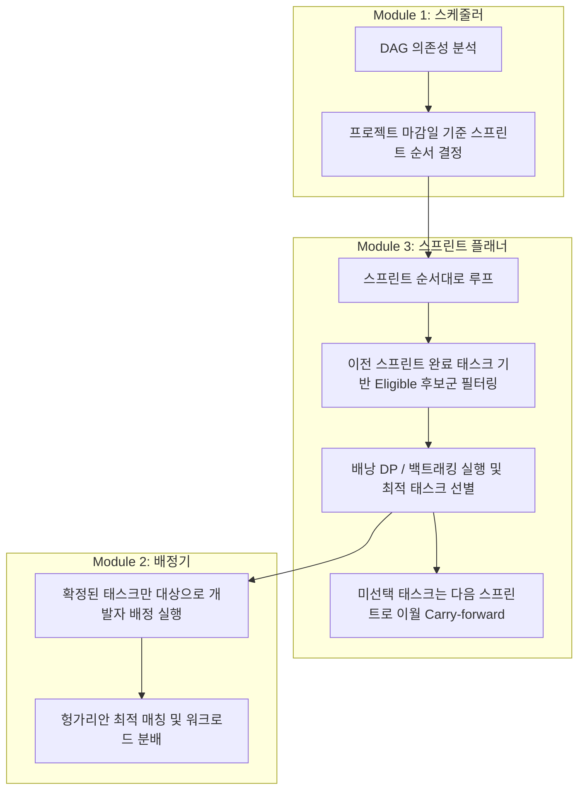

# 스프린트 플래너 (Module 3) 구현 및 유기적 연동 설계서

본 설계서는 `README.md`에 명시된 요구사항을 바탕으로 **스프린트 용량 제한 내에서 비즈니스 가치(Value)를 극대화하는 스프린트 플래너(Module 3)**를 개발하고, 이를 기존의 **프로젝트 스케줄러(Module 1)** 및 **배정기(Module 2)**와 유기적으로 결합하기 위한 계획을 정의합니다.

---

## 과목 요구사항 반영 계획

| 요구사항 | 충족 방안 |
|---|---|
| **자료구조 ≥ 2개 사용** | 1. **2D DP 테이블 (2-D List)**: 배낭 DP 알고리즘용 점화식 테이블 수립에 활용 2. **해시맵 (Dict)**: 태스크 속성 조회 및 스프린트별 태스크 분류, 결과 매핑에 활용 3. **집합 (Set)**: 완료된 태스크 추적 및 의존성 검사에 활용 (O(1) 검색) |
| **알고리즘 ≥ 2개 사용 (서로 다른 계열)** | 1. **[대표·동적계획법] 0/1 배낭 DP**: 스프린트 용량 내 가치 합을 최대화하는 최적해 산출 2. **[대표·백트래킹] 백트래킹 탐색**: 의존성을 탐색 경로에서 동적으로 가지치기하며 최적해 산출 3. **[보조·그리디] 가치 밀도(Value/Estimate) 기준 그리디**: 비교 기준선(Baseline) 제공 |
| **한글 주석 작성** | 코드 내에 자료구조와 알고리즘의 한글 주석을 상세하게 추가 |
| **의존성(stdlib) 준수** | 채점 모듈인 `planner.py`는 오직 파이썬 표준 라이브러리만을 사용하여 실행 가능하도록 작성 |

---

## 1. 대표 알고리즘 설계

### ① 0/1 배낭 DP (동적계획법)
- **목적**: 주어진 스프린트 용량 $W$와 $N$개의 태스크 목록(가중치: `estimate`, 가치: `value`)에 대해 최적의 태스크 조합을 찾습니다.
- **점화식**:
  $$dp[i][w] = \max(dp[i-1][w], dp[i-1][w - \text{estimate}_i] + \text{value}_i)$$
- **역추적 (Backtracking DP table)**: $dp[N][W]$부터 시작하여 위 점화식의 역방향으로 탐색하면서 실제 선택된 태스크 목록을 역산합니다.

### ② 백트래킹 (Backtracking)
- **목적**: 탐색 트리를 순회하되, 가지치기(Pruning)를 통해 탐색 공간을 줄여 최적해를 빠르게 도출합니다.
- **가지치기 기준**:
  1. **용량 초과**: 현재까지 선택한 스토리포인트 합이 $W$를 초과하는 경우 즉시 리턴.
  2. **가치 상한 바운드**: `현재까지 구한 가치 + 남은 모든 태스크의 가치 합 ≤ 지금까지 구한 최대 가치`인 경우 즉시 리턴.
- **장점**: 의존성(depends_on) 제약 조건을 백트래킹의 유효성 검사 단계에서 동적으로 바로 처리할 수 있습니다.

### ③ 가치 밀도 그리디 (Greedy)
- **목적**: 각 태스크의 가치 밀도(`value / estimate`)를 기준으로 내림차순 정렬하여 용량이 되는 한 탐욕적으로 채우는 비교용 기준선 알고리즘입니다.

---

## 2. Module 1 ↔ 3 ↔ 2 유기적 연동 설계

스프린트 플래너가 스케줄러(Module 1)와 배정기(Module 2) 사이에서 허브 역할을 하도록 유기적인 연동 파이프라인을 구축합니다.

### 연동 동작 메커니즘:
1. **의존성 필터링 (Dependency-Aware Candidates)**:
   - 각 스프린트를 순서대로 진행하며 후보군을 구성할 때, **아직 완료되지 않은 태스크 중 모든 선행 태스크(`depends_on`)가 이전 스프린트들에서 이미 완료(선택)된 태스크**들만 배낭의 후보군으로 올립니다.
2. **태스크 이월 (Carry-Forward)**:
   - 스프린트의 용량 부족으로 인해 선택되지 못한 태스크들은 소멸되지 않고, **해당 프로젝트의 다음 스프린트로 이월**되어 다음 스프린트의 후보군과 합쳐집니다.
3. **배정기와의 결합**:
   - 스프린트 플래너가 모든 스프린트에 대해 수립한 "최종 확정 태스크 목록"을 배정기(`Allocator`)에 전달하여 개발자 배정(`allocate_schedule`)을 구동합니다.

---

## 3. Proposed Changes

### [NEW] [planner.py](file:///c:/Users/USER/Desktop/26.1/Algorithm/squadron-main/planner.py)
- 0/1 배낭 DP, 백트래킹, 가치 밀도 그리디 알고리즘을 담은 신규 모듈을 작성합니다.
- 단일 스프린트 플래닝 및 글로벌 스케줄 연동 플래닝 API를 정의합니다.
- 데이터셋 검증을 위한 CLI 환경을 내장합니다.

### [MODIFY] [app.py](file:///c:/Users/USER/Desktop/26.1/Algorithm/squadron-main/app.py)
- **Streamlit 화면에 탭 추가**: `📅 Module 3 · 스프린트 플래너` 탭을 추가합니다.
- **시각화 구성**:
  - **단일 스프린트 데모 (`P3-S4`)**: README에서 제시된 A(6,60), B(5,40), C(5,40) 케이스에 대해 그리디 vs 최적해의 차이를 차트와 매핑 테이블로 대조합니다.
  - **글로벌 플래닝 시각화**: 각 스프린트별로 배낭 DP를 거쳐 확정된 태스크와 이월(Carry-forward)된 태스크를 시각화합니다.
  - **가치 향상 지표**: 플래너 적용 전(단순 할당) vs 플래너 적용 후(배낭 DP)의 **총 획득 비즈니스 가치(Total Value)** 비교 대시보드를 제공합니다.

---

## 4. Verification Plan

### Automated Verification
- **데모 반례 검증**: `python planner.py --demo-only` 실행 시 `P3-S4` 스프린트에서 그리디(가치 60)와 배낭 DP/백트래킹(가치 80)의 결과가 정확하게 산출되는지 확인합니다.
- **글로벌 일정 플래닝**: `python planner.py` 실행 시 전체 153개 태스크에 대해 의존성이 깨지지 않고 모든 스프린트의 플랜이 성공적으로 생성되는지 검증합니다.

### Manual Verification
- Streamlit 애플리케이션(`app.py`)을 실행하여 새로 추가된 `Module 3` 탭의 Gantt 차트 및 가치 비교 차트가 정상적으로 렌더링되는지 확인합니다.
